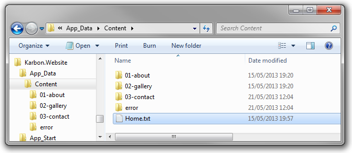
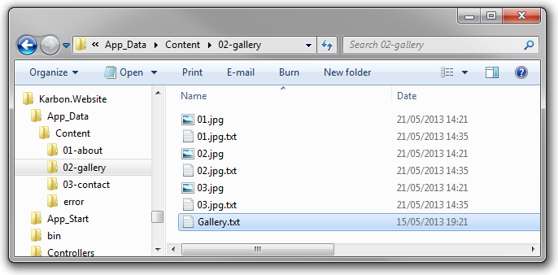

# Creating Content
All the content of your website is located in the `App_Data/Content` folder (we store it in the App_Data folder so that it prevents visitors accessing your data files directly).

## Creating the site structure

The folder structure inside the content folder will be mapped 1-to-1 with that of your websites URL structure.

For example, if you have an "contact-us" folder inside your content folder, your website will automatically have an "contact-us" page:

	http://yourdomain.com/contact-us

To create your websites structure then, it's as simple as creating a series of folders. And to add depth to your site structure, such as `http://yourdomain.com/contact-us/enquiries`, you simply create more folders inside your folders.

## Sorting pages

When it comes to organising pages at the same depth, you may want to arrange them in an order other than alphabetical. To define the sort order of you pages, simply prefix your folder names with a number followed by a hyphen and Karbon will automatically sort the pages accordingly.

	01-about
	02-gallery
	03-contact

Don't worry though, Karbon will automatically strip the number when it comes to generating the URL so you keep the pretty URLS.

	http://yourdomain.com/about
	http://yourdomain.com/gallery
	http://yourdomain.com.contact

## Creating visible and hidden pages

Prefixing numbers onto your folders not only defines the sort order of your pages, but it is also used to flag that content to be visible. Therefore, any folders prefixed with a number, such as...

	01-about
	02-gallery

...will be visible, where as folders without, such as...

	error
	sitemap

...will not.

It's pretty easy, **folders with numbers are for "visible" pages, folders without numbers are for "hidden" pages**. Don't worry though, you can still access hidden pages, it just means you can easily filter them out later when it comes to creating your sites navigation.

## Adding content

Every folder inside the content folder has a main text file, which holds all the content for that page. Those text files are very easy to read and edit and still they offer amazing possibilities.

Each content file is essentially a key value collection of content you can later access within your templates. Each key value pair must follow a set pattern in order for Karbon to be able to understand it.

An example key value pair would be as follows:

	Title: Welcome to Karbon CMS
	----

So each key value must start with a name, which can only contain letters and numbers (no spaces), followed by a `:`, followed by the actual value and terminated with a single line of four hyphens `----`.

To add more content to the page, simply add more key value pairs. You can create as many as you like with whatever name you like. 

	Title: Welcome to Karbon CMS
	----
	SubTitle: A lightweight, open source, file based CMS for ASP.NET  MVC 
	----
	Body: Lorem ipsum dolor sit amet, consectetur adipiscing elit. 
	----

We'll show you in a little while how you can retrieve your content and display it within your templates.

## Adding files

As well as content, Karbon makes it really easy for you to add images, videos, sounds and documents to you pages too. To add them, simply drop them into the folder for your page like this:

Karbon will automatically pick up any files in your pages folder and associate them with the page giving you easy access to them within your templates.

Similar to content, simply prefix your images with a number to define the order they should appear.

Jump over to BLA BLA BLA, to see how to acess files within your templates.

## Adding meta data to files

Just like content, Karbon allows you add additional meta data, such as titles, captions and author names to your files when you access them later on. As you might expect, this is also achieved by adding additional text files to the folder.

To add meta data to a file simply create a text file with the exact same name, including the file extension, but ending with an additional `.txt`. 

In your text files, simply create more key value pairs exactly as you would for content, then Karbon will automatically pick up this additional information and give you easy access to it.

Jump over to BLA BLA BLA, to se how to access file meta data within your templates.