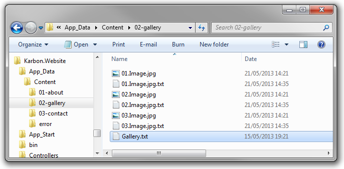

# Strongly Typing
Accessing data in your templates via the `.Data` property is certainly simple, but it doesn't offer much discoverability for you content items and accessing values by string can be error prone. To combat this, we've also added the ability to have strongly typed views allowing you to access key values in your content files as real life properties on your content items.

Lets say we have a `Home.txt` file located in the root of our content folder containing the following key values.

	Title: Welcome to Karbon CMS
	----
	SubTitle: A lightweight, open source, file based CMS for ASP.NET  MVC 
	----
	Body: Lorem ipsum dolor sit amet, consectetur adipiscing elit. 
	----

## Creating your model

Before we can access these properties in our view in a strongly typed manor, we first need to create our custom type. In your `Models` folder, create a class `Home.cs` with the following contents:

	public class Home : Content
    {
        public string Title { get; set; }
        public string SubTitle { get; set; }
		public string Body { get; set; }
    }

This is a pretty simple poco class with the only prerequisite being that it must inherit from the `Karbon.Core.Models.Content` base class.

## Strongly typed views
Now, in your template, instead of inheriting from `KarbonView` have it inherit from `KarbonView<TCurrentPageType>` passing in your type as the type parameter like so:

	@inherits KarbonView<Home>

Within your views, instead of accessing properties like:

	<h1>@Model.CurrentPage.Get("Title")</h1>

You should now be able to access your properties like so:

	<h1>@Model.CurrentPage.Title</h1>

You should even get full intellisense support too.

But how did Karbon know to map the data to the `Home` entity you might ask, well, just like how Karbon maps custom templates, it uses the same method to look for strongly typed models. So because in our example, our text file was named `Home.txt`, Karbon searched for a model class with the name "Home". If a model class is not found, then it will resort to the basic `Content` model instead.

The strongly typing isn't just limited to the `.CurrentPage` property, you can also strongly type the `.HomePage` property too. To do this, just create a model for your home page content, and have your views inherit the `KarbonView<TCurrentPageType, THomePageType>` base class like so:

	@inherits KarbonView<About, Home>

## Strongly typed methods

Many of the content API methods also have strongly typed alternatives, so you can do things like:

	@Model.CurrentPage.Children<Product>()

Which will grab all children that are of type `Product` with the result of the method call being of type `IEnumerable<Product>`, allowing you to access the results in a strongly typed manor too.

Checkout the cheat sheet for a full list of all supported strongly typed methods.

## Strongly typed media

But that's not all, you can even strongly type your media items too. Strongly typing your media items does work a little different than content though. You still create your model the same way, however you do need to inherit from one of the `File` base classes:

-	`Karbon.Core.Models.File` - A generic file
-	`Karbon.Core.Models.ImageFile` - An image file
-	`Karbon.Core.Models.VideoFile` - A video file
-	`Karbon.Core.Models.SoundFile` - A sound file
-	`Karbon.Core.Models.DocumentFile` - A document file

For example:

    public class Image : ImageFile
	{
    	public string Caption { get; set; }
    }

Because the meta data file for a media item has to have the same name as the media file itself, we also need to change how Karbon identifies the type to map the meta data to, so to do this, we just need to add the type to the end of the file name like so:

Within your views, you can now access your media like so:

	@Model.CurrentPage.Images<Image>()

And Karbon will return you a list of Images that strongly typed to your model. It'll also filter out any images told to map to a different type too, so you only get the files you want in the type you want.